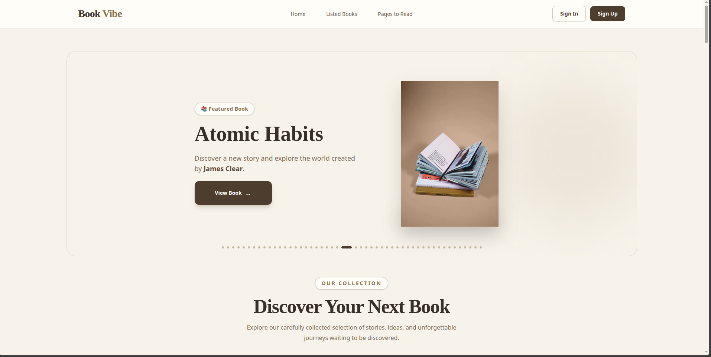
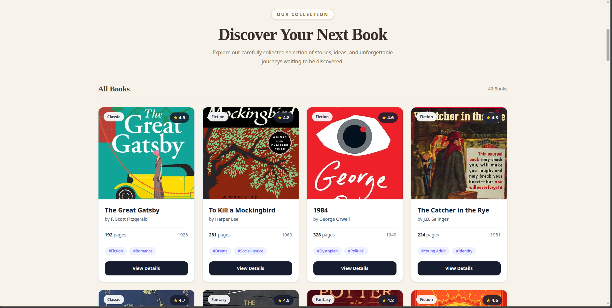
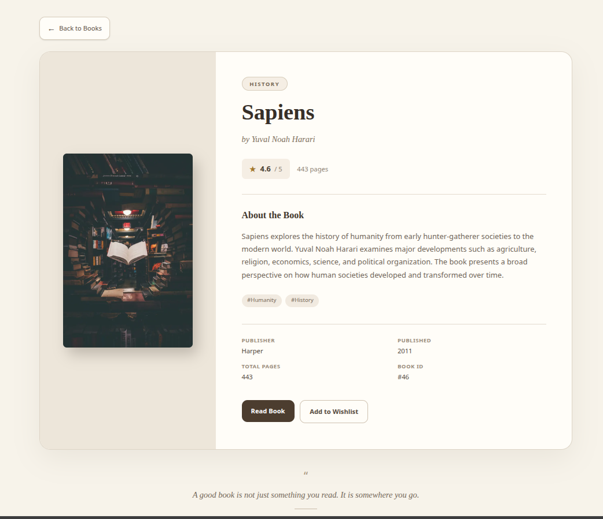
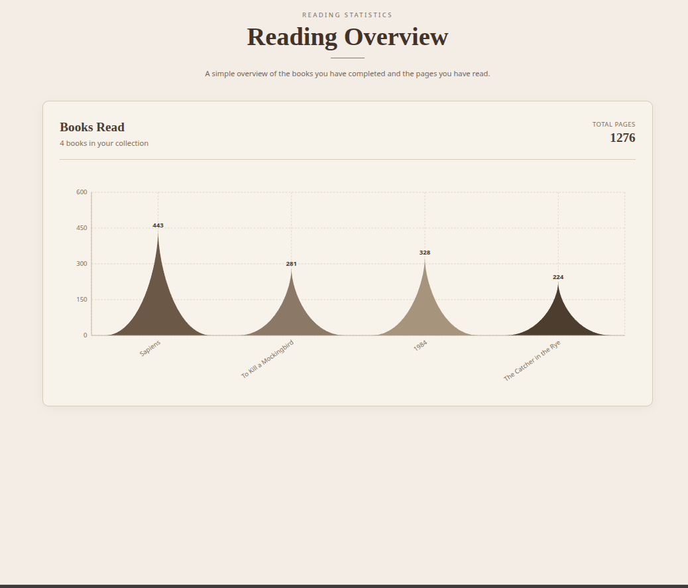
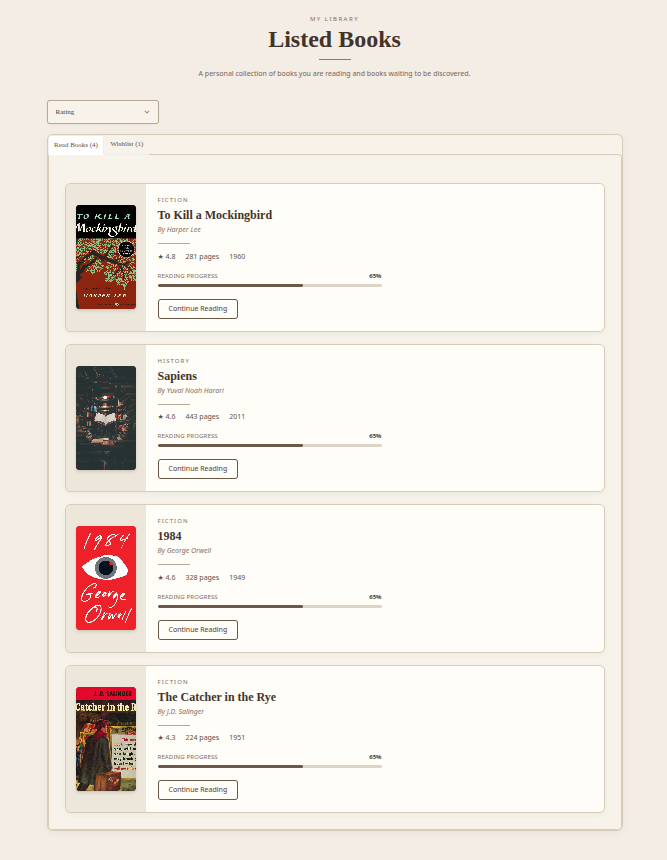

# 📚 Book Vibe

**Book Vibe** is an e-commerce-style online bookstore where users can explore and discover different types of books. Users can browse books, view book information, and track their reading activity through a visual activity chart.

🔗 **Live Website:** https://book-vibe-orcin-three.vercel.app/

---

## 📸 Project Preview

### 🏠 Home Page



### 📚 Book Collection



### 📖 Book Details



### 📊 Reading Statistics



### 📋 Listed Books




---

## ✨ Features

* 📚 Browse different categories of books
* 🔎 Explore and discover books
* 📖 View book details
* 🛒 E-commerce-style book browsing experience
* 📊 Track reading activity with a visual chart
* 📈 Display reading/activity statistics
* 📱 Responsive design for different screen sizes
* 🎨 Modern and clean user interface
* ⚡ Fast and interactive user experience

---

## 🛠️ Technologies Used

* **TypeScript** — Main programming language
* **Node.js** — Development/runtime environment
* **Tailwind CSS** — Styling and responsive design
* **DaisyUI** — UI components
* **Next.js** — React-based framework and application structure

---

## 📦 Dependencies

### Main Dependencies

* `next`
* `react`
* `react-dom`

### Development Dependencies

* `@tailwindcss/postcss`
* `@types/node`
* `@types/react`
* `@types/react-dom`
* `daisyui`
* `eslint`
* `eslint-config-next`
* `tailwindcss`
* `typescript`

---

## 🚀 Getting Started

Follow these steps to run the project locally.

### 1. Clone the Repository

```bash
git clone <your-github-repository-url>
```

### 2. Navigate to the Project Directory

```bash
cd <project-folder-name>
```

### 3. Install Dependencies

Using npm:

```bash
npm install
```

Or using yarn:

```bash
yarn install
```

### 4. Run the Development Server

```bash
npm run dev
```

### 5. Open in Browser

After starting the development server, open:

```text
http://localhost:3000
```

---

## 📊 Reading Activity

One of the main features of **Book Vibe** is the reading activity visualization.

When a user reads a book, the reading activity can be represented through a chart, making it easier to track and understand their reading progress and activity.

---

## 🎨 UI & Design

The project uses **Tailwind CSS** along with **DaisyUI** to create a clean, responsive, and modern interface.

The design focuses on:

* Simple navigation
* Responsive layouts
* Reusable UI components
* Easy book discovery
* Clear presentation of book information
* Visual representation of reading activity

---

## 🔗 Links

🌐 **Live Website:**
https://book-vibe-orcin-three.vercel.app/

💻 **GitHub Repository:**
https://github.com/AtiqurRahmanLabib/book-vibe

---

## 👨‍💻 Author

**Atiqur Rahman Labib**

If you like this project, feel free to ⭐ the repository!
